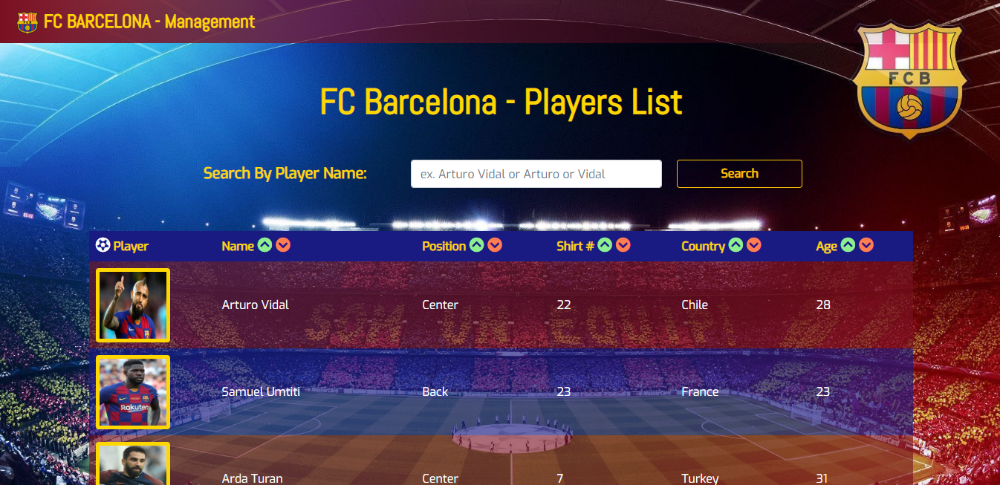

# Employee Directory      
### Homework - 19 / Employee Directory with React app

- Link to Deploy app, at the end. [>> GO ⬇️ <<](#url)



- Directory of all players from FC Barcelona main soccer team!


- Search by Player Name


- Sort by All categories Ascending and Descending order


## 📌Table of Content

* [Description](#description)
* [Installation](#installation)
* [Usage](#usage)
* [Test](#test)
* [Contributing](#contributing)
* [License](#license)
* [Details](#details)
* [Features](#features)
* [URL](#url)
* [Questions](#questions)

## 📋Description
"Employee Directory" is a web application builded using React App (front end). Giving users a fast and easy way to track their employees non-sensitive data, allowing them to access that information anytime. Having the functionality of filter employees by name, last or full-name, plus sort them by any category in ascending and descending order. Powered by React framework.
```
An employee or manager would benefit greatly 
from being able to view non-sensitive data about other employees. 
It would be particularly helpful to be able to filter employees by name..
```
- Open the application using the URL on your Browser (recomended: Google Chrome).


## 💿Installation
  1. Clone the repository 
  2. npm install
  3. open app using gitbash ```npm start```

## ▶️Usage
Open the server app using ```node server``` in your terminal (root repo).   

## 📊Test
 ```
 npm run test. (included with React app)
 ```


## 🤝Contributing
Feel free to pull request and give me your suggestions if any.
          
## ⚖️License  
This project is under the MIT License.

## 📑Details

This repository content the files: JavaScript "App.js" and "index.js (main app) inside the src folder, plus all components used to build this app (all with their respective style.css file), Mit license"LICENSE.txt", "package.json", "package-lock.json", models, node_modules", an "assets" folder with the captures and gifs for this Readme File.

## 📀Features
- Bootstrap styles

  


## 🔗URL  

- Check my Demos on my Youtube page "https://www.youtube.com/channel/UCev6xJU1FGx1IbRjQhtjKcQ"
- The URL to this repo page is "https://github.com/diegolehyt/Employee-Directory.git"
- Deploy App on GitHub pages Here! --> "https://diegolehyt.github.io/Employee-Directory/" <--

## 👤Questions  
     


✉️ E-mail: diegolehy00@gmail.com
